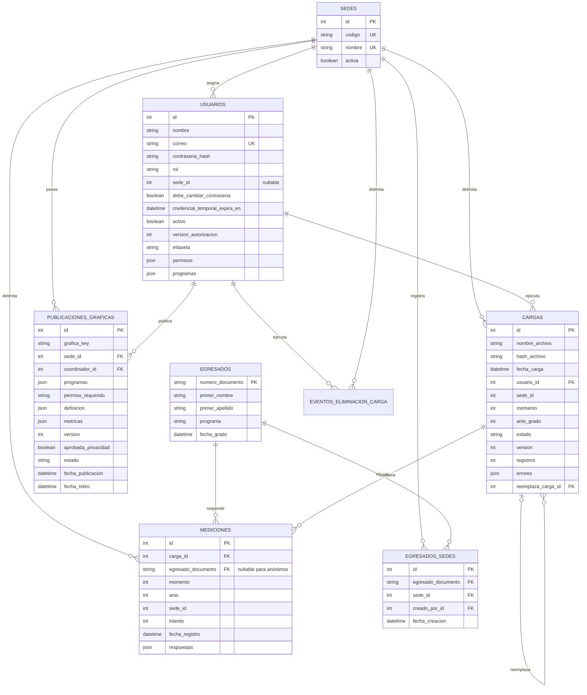

# Modelo de datos vigente

**Estado:** descripción del modelo SQLAlchemy actual

**Verificado:** 2026-09-24

**Esquema canónico:** [`../specs/db/oeupb-schema.sql`](../specs/db/oeupb-schema.sql)

## Modelo implementado

## Decisiones vigentes

- El documento evita duplicar egresados identificados.
- Una medición almacena las respuestas dinámicas en JSON.
- Las encuestas anónimas pueden producir mediciones sin egresado asociado.
- `sede_id` está en `mediciones`; `egresados` no pertenece directamente a una sede.
- `usuarios.sede_id` referencia el catálogo `sedes`. La regla de que solo `Admin_CTIC` puede no tener sede se aplica en backend al crear y editar cuentas; el esquema todavía no tiene un CHECK que la garantice (DB-03).
- Cada archivo se registra como `cargas`; una recarga crea una versión nueva y marca la anterior como reemplazada dentro de la misma transacción.
- `mediciones.anio` conserva el nombre físico legado, pero su significado vigente es año de grado o cohorte.
- `carga_id` y `cargas.usuario_id` son obligatorios. Las cargas históricas se atribuyen a una cuenta técnica desactivada.
- Cada medición posee `intento` y `fecha_registro`; la combinación persona/sede/momento/cohorte/intento es única.
- El borrado físico de una carga conserva primero un evento inmutable sin FK hacia la carga eliminada.
- El alta manual crea `egresados_sedes`; crear, editar o eliminar conserva un evento en `auditoria_egresados` con actor, sede, motivo y cambios.

## Modelo objetivo aprobado

ADR-012 conserva `Egresado`–`Medicion` como modelo objetivo. La propuesta archivada de `historial_academico` y `encuestas_laborales` queda descartada para el alcance vigente.

## Reglas de consulta

- Toda lectura de mediciones debe limitarse por sede según la identidad autenticada.
- Un egresado solo puede exponerse si existe al menos una medición visible o un vínculo manual `egresados_sedes` para la sede del usuario.
- La edición manual se bloquea (409) cuando la misma identidad está vinculada a otra sede; la eliminación se bloquea mientras existan mediciones. No existe custodia institucional (ADR-014).
- Al eliminar una carga se borran los egresados sin mediciones y sin vínculo `egresados_sedes`; los registros manuales se conservan.
- Las consultas de historial deben filtrar nuevamente por sede, incluso si la lista inicial ya fue filtrada.
- Las respuestas JSON no deben interpolarse directamente en SQL.

## Gráficas publicadas

`publicaciones_graficas` representa la instantánea agregada aprobada con sede/coordinador propietarios, programas, permiso requerido, definición de renderizado, métricas numéricas inmutables, versión, estado y marcas de tiempo. Una nueva publicación de la misma clave conserva la versión anterior como `reemplazada`; retirar conserva la fila como `retirada`.

La publicación no copia documentos, nombres, correos, respuestas individuales ni archivos fuente. El cliente solo envía la definición; etiquetas, series y programas los calcula el backend y las etiquetas provienen de nombres de programa, categorías fijas o respuestas a variables del catálogo RN-31 con al menos 5 observaciones. No existe una FK hacia mediciones: la instantánea no concede acceso a datos fuente ni se recalcula automáticamente. Una actualización crea una versión nueva con nueva confirmación de privacidad (ADR-015).

La unicidad de `egresados.numero_documento` no implica unicidad de medición. `application/medicion_policy.py` declara que los indicadores actuales toman el último intento identificado y conservan todas las mediciones anónimas permitidas en agregados.

Los programas autorizables no provienen todavía de un catálogo institucional independiente: se derivan de los nombres distintos observados en cargas visibles de la sede. La persistencia de asignaciones debe conservar el valor normalizado y permitir distinguir renombres o alias futuros sin conceder acceso por coincidencias ambiguas.
