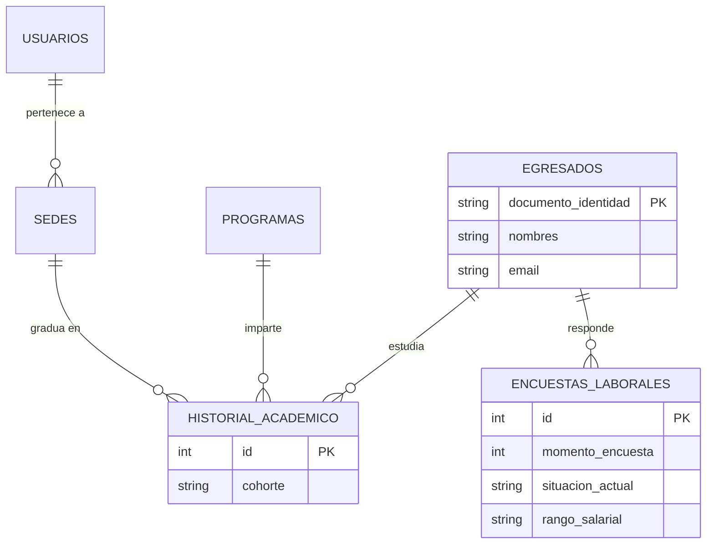

# Modelo de Datos (Entidad-Relación)

## 1. Estrategia de Almacenamiento
El sistema OE UPB utiliza **MySQL** como motor de base de datos relacional. La principal decisión arquitectónica aquí es **la Normalización**. En lugar de volcar los archivos Excel del OLE directamente en una sola tabla gigante (lo cual generaría duplicados cada vez que se sube un nuevo archivo), los datos se separan lógicamente.

Esto permite que, si un mismo egresado responde la encuesta del "Momento 1" este año y la del "Momento 5" en cuatro años, el sistema actualice su situación laboral sin duplicar sus datos personales ni académicos.

## 2. Diccionario de Tablas Principales

### `usuarios` (Administración y Acceso)
Almacena a todos los usuarios del sistema. Todos pertenecen a un silo de datos (sede).
* `id` (PK)
* `nombre`
* `email`
* `password_hash`
* `rol` (ENUM: 'Admin_CTIC', 'Coordinador_Sede', 'Directivo')
* `sede_id` (FK - **Obligatorio para todos**. Define el "silo de datos" al que tienen acceso).

### `egresados` (Datos Personales Maestros)
Almacena la identidad inmutable del graduado.
* `documento_identidad` (PK - Clave primaria para evitar duplicados)
* `nombres`
* `apellidos`
* `email_personal`
* `telefono`
* `ciudad_residencia`

### `historial_academico` (Datos de Grado)
Relaciona a un egresado con lo que estudió (un egresado podría tener un pregrado y luego un posgrado).
* `id` (PK)
* `egresado_doc` (FK)
* `programa_id` (FK)
* `cohorte` (Año/Semestre de grado)
* `sede_id` (FK)

### `encuestas_laborales` (Situación Laboral y Respuestas Dinámicas)
Almacena los resultados extraídos del Excel. Cada fila representa una encuesta (Momento 0, 1 o 5).
* `id` (PK)
* `egresado_doc` (FK)
* `momento_encuesta` (INT: 0, 1 o 5)
* `situacion_actual` (Columna fija para filtros rápidos)
* `rango_salarial` (Columna fija para filtros rápidos)
* `fecha_carga` (Timestamp)
* `respuestas_completas` (Columna de tipo **JSON**): *Aquí se guarda el resto de las 50+ preguntas del Excel empaquetadas. Esto evita tener que crear 50 columnas en la base de datos y permite que el Excel cambie en el futuro sin romper el sistema.*

## 3. Diagrama Entidad-Relación (ER)

## 4. Procesamiento Analítico (La Librería de Python)
Para analizar todas las preguntas contenidas en el campo JSON dinámico sin sobrecargar la base de datos MySQL, el sistema se apoya en la librería de análisis de datos de Python (**Pandas**). 

**El flujo es el siguiente:** 
1. MySQL guarda los datos de forma rápida y segura.
2. Python extrae la columna JSON y usa Pandas para convertirla en un *DataFrame* (una tabla en memoria RAM súper rápida).
3. Pandas agrupa, cruza y cuenta las respuestas dinámicamente en fracciones de segundo.
4. Angular recibe el resumen estadístico ya calculado y grafica el resultado.

