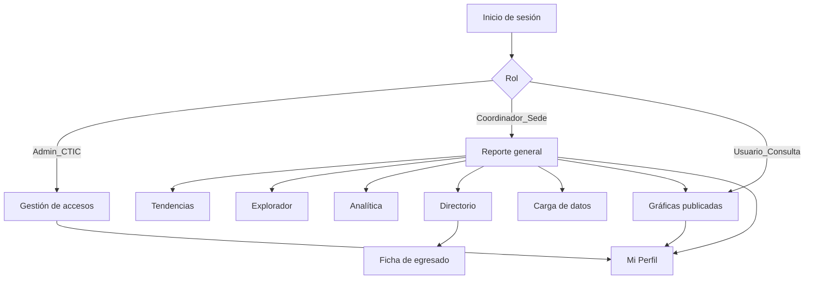
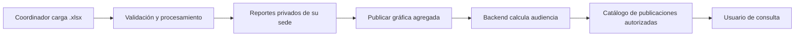

# Mapa de pantallas y flujo — OE UPB

**Estado:** mockups estáticos canónicos de referencia obligatoria para el desarrollo de UI.  
**Fuente visual:** [`../design/design.md`](../design/design.md).  
**Fuente funcional:** rutas y plantillas de `OEUPB-Frontend/src/app/`.  
**Uso:** abrir [`index.html`](index.html) o cualquiera de los HTML de esta misma carpeta. Cada archivo es un mockup independiente, utiliza [`mockups.css`](mockups.css) y no requiere API ni credenciales.

## Anchos de referencia y comportamiento responsive

| Dispositivo / Viewport | Ancho de prueba | Comportamiento del shell y componentes |
|---|---|---|
| **Escritorio grande** | `>= 1440 px` | Sidebar completo de 280 px; canvas fluido con padding de 32 px; visualización multicolumna óptima. |
| **Escritorio estándar** | `1280 px` | Sidebar completo de 280 px; grids analíticos y administrativos en disposición paralela. |
| **Tablet (Rail)** | `768 – 1279 px` | Sidebar colapsa automáticamente a rail de 72 px con iconos centrados y tooltips nativos. Grids analíticos pasan a 1 columna en <= 1100 px; grid administrativo colapsa en <= 1150 px. Padding de 24 px. Tablas con `.table-scroll`. |
| **Móvil (Drawer)** | `< 768 px` | Sidebar fuera de pantalla como drawer off-canvas accesible mediante `.mobile-header` (56 px). Modales apilados verticalmente, botones touch target (44 px / 38 px), tablas con contención horizontal protegida sin recortes invisibles. Padding de 16 px. |

## Matriz de variantes y estados por pantalla

| Identificador | Archivo mockup | Estrategia responsive | Variantes implementadas y representadas |
|---|---|---|---|
| **Inicio de sesión** | [`login.html`](login.html) | Tarjeta bipartita Dual-Zone (`width: min(880px, 100%)`) con panel de marca institucional oscuro y formulario daylight; colapso vertical fluido en móvil (`< 768 px`) | **Base**: Formulario de credenciales con iconos de apoyo, etiquetas accesibles y contexto institucional UPB. |
| **Inicio de sesión (Cambio)** | [`login-cambio-contrasena.html`](login-cambio-contrasena.html) | Modal accesible con scroll interno (`max-height: calc(100vh - 48px)`) sobre tarjeta base Dual-Zone | **Modal**: Cambio obligatorio tras primer ingreso con credencial temporal y jerarquía de acciones. |
| **Reporte general** | [`reporte-general.html`](reporte-general.html) | KPIs colapsan a 1 columna; gráficas colapsan a 1 columna en <= 1100 px | **Carga/Base**: Visualización de carga de indicadores y cabeceras con wrap. |
| **Tendencias** | [`tendencias.html`](tendencias.html) | Controles en cuadrícula auto-fit; gráficas responsivas | **Carga/Base**: Selección de indicador y cálculo dinámico de tendencias. |
| **Explorador** | [`explorador.html`](explorador.html) | Panel de filtros de 2 filas con botones alineados; gráfica fluida | **Vacío/Base**: Estado inicial esperando selección de variable para graficar. |
| **Analítica y alertas** | [`analitica.html`](analitica.html) | KPIs colapsables; dos columnas a una en <= 1100 px | **Base / Vacío**: Resumen analítico y alerta de seguimiento sin incidencias. |
| **Directorio** | [`directorio.html`](directorio.html) | Contenedor `.table-scroll` con tabla `min-width: 900px`; paginación apilable | **Base**: Listado de egresados, badges de momentos, acciones con jerarquía segura. |
| **Ficha de egresado** | [`ficha-egresado.html`](ficha-egresado.html) | Grid de perfil adaptable; línea de tiempo vertical | **Base / Detalle**: Datos individuales y trayectoria en encuestas oficiales (OLE). |
| **Gráficas publicadas** | [`publicaciones.html`](publicaciones.html) | Tarjetas `repeat(auto-fit, minmax(320px, 1fr))` | **Base**: Catálogo de instantáneas agregadas autorizadas por sede (v1). |
| **Carga de datos** | [`carga-datos.html`](carga-datos.html) | Grid adaptable; historial en `.table-scroll` con `min-width: 650px` | **Base**: Subida de .xlsx (zona de arrastre con icono) e historial de vigencia. |
| **Gestión de usuarios** | [`gestion-usuarios.html`](gestion-usuarios.html) | Admin-grid pasa a 1 col en <= 1150 px; tabla en `.table-scroll` (`1000px`) | **Base**: Alta institucional de coordinadores y tabla de usuarios activos con acciones outline. |
| **Gestión de usuarios (Alta)** | [`gestion-usuarios-credencial.html`](gestion-usuarios-credencial.html) | Modal responsive con acción secundaria primero y primaria al final | **Modal**: Visualización única de contraseña temporal de 24 horas. |
| **Mi Perfil** | [`mi-perfil.html`](mi-perfil.html) | Grid colapsable; filas de información con wrap (`.info-row`) | **Base**: Identidad, sede asignada y alcance de permisos. |

## Reglas de mantenimiento

- Toda pantalla o cambio visual debe tener primero un mockup correspondiente en esta carpeta.
- Este mapa se actualiza en el mismo cambio que agregue, retire o modifique una pantalla, modal o transición.
- Todos los mockups consumen `mockups.css`, cuyos tokens derivan estrictamente de `design/design.md`.
- Los mockups no utilizan emojis. La iconografía corresponde a Lucide, la librería estándar definida en el sistema de diseño.
- Las variantes de carga, vacío, error y modal deben conservar la geometría final de la pantalla.
- Las tablas usan exclusivamente datos sintéticos identificables como `Demo`; nunca contienen datos personales, archivos o credenciales reales.
- Las tablas deben estar siempre contenidas en contenedores `.table-scroll` con anchos mínimos declarados para garantizar lectura sin truncado a 320 px.
- Las tarjetas y paneles conservan siempre un borde perimetral neutro uniforme; se prohíbe el uso de bordes de color laterales (izquierdo o derecho) o superiores como franjas de alerta o decoración.

## Alcance por rol

| Rol | Inicio tras autenticación | Pantallas disponibles |
|---|---|---|
| `Admin_CTIC` | Gestión de accesos | Administrar usuarios, Mi Perfil |
| `Coordinador_Sede` | Reporte general | Reporte, Tendencias, Explorador, Analítica, Directorio, Publicaciones, Carga, Administración de usuarios, Mi Perfil, Ficha de egresado |
| `Usuario_Consulta` | Gráficas publicadas | Publicaciones, Mi Perfil |

La aplicación real protege cada ruta mediante `authGuard` o `rolesGuard`; el mockup representa las pantallas para la revisión de diseño y no sustituye esa autorización.

## Flujo principal

## Flujo de datos y publicación

Los mockups conservan deliberadamente estados de carga y vacíos donde el frontend actual obtiene datos de la API. Esto evita inventar datos de egresados o indicadores que no estén disponibles en el entorno de desarrollo.
