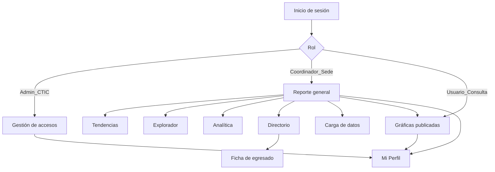
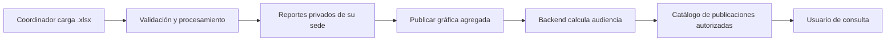

# Mapa de pantallas y flujo — OE UPB

**Estado:** mockups estáticos canónicos de referencia obligatoria para el desarrollo de UI.  
**Fuente visual:** [`../design/design.md`](../design/design.md).  
**Fuente funcional:** rutas y plantillas de `OEUPB-Frontend/src/app/`.  
**Uso:** abrir [`index.html`](index.html) o cualquiera de los HTML de esta misma carpeta. Cada archivo es un mockup independiente, utiliza [`mockups.css`](mockups.css) y no requiere API ni credenciales.

## Anchos de referencia y comportamiento responsive

| Dispositivo / Viewport | Ancho de prueba | Comportamiento del shell y componentes |
|---|---|---|
| **Escritorio grande** | `>= 1440 px` | Sidebar interactivo colapsable: expandido a 280 px por defecto o contraído a rail de 72 px mediante botón visible (`.sidebar-toggle-btn`); tooltips flotantes (`.sidebar-floating-tooltip`) en estado contraído; transición suave sincronizada con el canvas (`.content`); persistencia en `localStorage`. Canvas fluido con padding de 32 px; visualización multicolumna óptima. Brand lockup con escudo institucional oficial (`escudo-upb.png`). |
| **Escritorio estándar** | `1280 px` | Sidebar interactivo colapsable (280 px expandido / rail 72 px contraído con botón de alternancia y tooltips flotantes); grids analíticos y administrativos en disposición paralela; brand lockup institucional con escudo UPB. |
| **Tablet (Rail)** | `768 – 1279 px` | Sidebar colapsa automáticamente a modo rail de 72 px con iconos centrados y tooltips flotantes (`.sidebar-floating-tooltip`), optimizando el espacio horizontal sin alternancia manual. Grids analíticos pasan a 1 columna en <= 1100 px; grid administrativo colapsa en <= 1150 px. Padding de 24 px. Tablas con `.table-scroll`. |
| **Móvil (Drawer)** | `< 768 px` | Sidebar posicionado inicialmente fuera de pantalla como drawer off-canvas (`transform: translateX(-100%)`), desplegable sobre el viewport mediante el botón de hamburguesa (`.menu-toggle-btn`) ubicado en la barra superior fija (`.mobile-header`, 56 px) con escudo institucional en `.mobile-brand`. Cuenta con fondo semitransparente superpuesto (`.sidebar-backdrop`) interactivo para cierre táctil, botón explícito de cierre (`.sidebar-close-btn` con icono X), cierre automático al navegar o presionar Escape, bloqueo de desplazamiento de fondo (`mobile-nav-open`) y touch targets ergonómicos (mínimo 44 px). Modales apilados verticalmente, tablas con contención horizontal protegida sin recortes invisibles. Padding de 16 px. |

## Matriz de variantes y estados por pantalla

| Identificador | Archivo mockup | Estrategia responsive | Variantes implementadas y representadas |
|---|---|---|---|
| **Inicio de sesión** | [`login.html`](login.html) | Tarjeta bipartita Dual-Zone (`width: min(880px, 100%)`) con perímetro neutro uniforme Level 1/2 sobre Split Dual-Zone suave (105° escritorio, 180° móvil); cabecera institucional compacta en móvil para interacción inmediata desde 320 px | **Base**: Acceso institucional con credenciales universitarias, botón de alternancia de contraseña (Lucide `eye`/`eye-off`), jerarquía institucional depurada ("Observatorio de Egresados" / "OEUPB", sin etiquetas de momentos ni contenedores rojos) y enlace accesible a primer ingreso. |
| **Inicio de sesión (Cambio)** | [`login-cambio-contrasena.html`](login-cambio-contrasena.html) | Modal accesible con scroll interno (`max-height: calc(100vh - 48px)`) sobre tarjeta base depurada y fondo Split Dual-Zone | **Modal**: Cambio obligatorio tras primer ingreso con credencial temporal y jerarquía de acciones sobre fondo Split Dual-Zone. |
| **Reporte general** | [`reporte-general.html`](reporte-general.html) | Tarjeta de filtros con wrap; 4 KPIs en una fila (>= 1440 px), 2×2 (< 1440 px) y 1 columna (< 768 px); gráficas en `minmax(0, 1fr)` que colapsan a 1 columna en <= 1100 px | **Carga/Base**: filtros de programa, cohorte y momento; KPIs de total, empleabilidad, empleo formal y salario con rango; gráficas de programas, satisfacción y estado laboral con estado de publicación. |
| **Tendencias** | [`tendencias.html`](tendencias.html) | Tarjeta de filtros con wrap; controles en cuadrícula auto-fit; gráficas responsivas | **Carga/Base/Vacío**: filtros de programa y cohorte, selección de indicador y comparación entre momentos con el estado de datos insuficientes y la nota de programas sin pares. |
| **Explorador** | [`explorador.html`](explorador.html) | Panel de filtros de 2 filas con botones alineados; gráficas fluidas apiladas; selects contenidos en su columna (`min-width: 0`) | **Vacío/Base/Error**: varias gráficas simultáneas con `Quitar gráfica`, error de publicación con reintento y `Crear otra gráfica`. |
| **Analítica y alertas** | [`analitica.html`](analitica.html) | KPIs colapsables; dos columnas a una en <= 1100 px | **Base / Vacío**: Resumen analítico y alerta de seguimiento sin incidencias. |
| **Directorio** | [`directorio.html`](directorio.html) | Contenedor `.table-scroll` con tabla `min-width: 900px`; paginación apilable | **Base**: Listado de egresados, badges de momentos, acciones con jerarquía segura. |
| **Ficha de egresado** | [`ficha-egresado.html`](ficha-egresado.html) | Grid de perfil adaptable; línea de tiempo vertical | **Base / Detalle**: Datos individuales y trayectoria en encuestas oficiales (OLE). |
| **Gráficas publicadas** | [`publicaciones.html`](publicaciones.html) | Secciones apiladas con encabezado `headline-md`; tarjetas `repeat(auto-fit, minmax(320px, 1fr))` que pasan a 1 columna en <= 1100 px | **Base/Carga/Vacío/Error** con `Actualizar`. `Coordinador_Sede`: sección **Mis publicaciones** (`Retirar publicación` → `Retirando…`, error con reintento bajo la tarjeta; vacío "Aún no has publicado gráficas") y sección **Publicadas por otros coordinadores** de su sede y de las demás (vacío "No hay gráficas publicadas por otros coordinadores"). `Usuario_Consulta`: una sola lista según permisos y programas (ADR-018). |
| **Carga de datos** | [`carga-datos.html`](carga-datos.html) | Grid adaptable; historial en `.table-scroll` con `min-width: 650px` | **Base**: Subida de .xlsx (zona de arrastre con icono) e historial de vigencia. |
| **Gestión de usuarios** | [`gestion-usuarios.html`](gestion-usuarios.html) | Admin-grid `minmax(320px, 380px) minmax(0, 1fr)` que pasa a 1 col en <= 1150 px; tabla en `.table-scroll` (`1000px`) | **Base**: Alta institucional de coordinadores y tabla de usuarios activos con acciones outline; programas asignados sin datos actuales en cursiva. |
| **Gestión de usuarios (Alta)** | [`gestion-usuarios-credencial.html`](gestion-usuarios-credencial.html) | Modal responsive con acción secundaria primero y primaria al final | **Modal**: Visualización única de contraseña temporal de 24 horas. |
| **Mi Perfil** | [`mi-perfil.html`](mi-perfil.html) | Grid colapsable; filas de información con wrap (`.info-row`) | **Base**: Identidad, sede asignada y alcance de permisos. |

## Reglas de mantenimiento

- Toda pantalla o cambio visual debe tener primero un mockup correspondiente en esta carpeta.
- Este mapa se actualiza en el mismo cambio que agregue, retire o modifique una pantalla, modal o transición.
- Todos los mockups consumen `mockups.css`, cuyos tokens derivan estrictamente de `design/design.md`.
- Los mockups no utilizan emojis. La iconografía corresponde a Lucide, la librería estándar definida en el sistema de diseño.
- **Arquitectura y comportamiento de la barra lateral por dispositivo:**
  - **Escritorio (`>= 1280 px`):** barra lateral colapsable interactiva con soporte para alternancia entre 280 px (expandido) y 72 px (rail contraído) mediante botón visible (`.sidebar-toggle-btn`). Al contraerse, despliega tooltips flotantes (`.sidebar-floating-tooltip`) en hover sobre los iconos, sincroniza su transición suave con el margen del contenido principal (`.content`) y conserva la preferencia en `localStorage` (`oeupb_sidebar_collapsed`).
  - **Tablet (`768 – 1279 px`):** opera automáticamente como rail fijo de 72 px con iconos centrados y tooltips flotantes (`.sidebar-floating-tooltip`), reservando el espacio horizontal para datos y gráficos sin intervención manual.
  - **Móvil (`< 768 px`):** opera bajo el patrón drawer off-canvas, ubicándose inicialmente fuera de pantalla (`transform: translateX(-100%)`) con transición suave (`transition: transform 0.25s ease-in-out`). Se abre mediante el botón de hamburguesa (`.menu-toggle-btn`) de la barra superior fija (`.mobile-header`, 56 px). Incorpora una capa superpuesta de fondo semitransparente (`.sidebar-backdrop`) que permite el cierre táctil al tocar fuera del panel, botón dedicado de cierre (`.sidebar-close-btn` con icono X), cierre automático al seleccionar una ruta o pulsar la tecla Escape, bloqueo de desplazamiento del fondo (`body.mobile-nav-open`) para prevenir scroll accidental detrás del menú, y optimización táctil ergonómica con áreas de interacción (touch targets) de al menos 44 px.
- **Identidad institucional y escudo UPB:** todas las pantallas autenticadas y la cabecera móvil incorporan el escudo institucional oficial (`escudo-upb.png`) mediante la clase `.brand-logo` de manera limpia y sin recuadro de fondo (`.brand-mark`), reemplazando el texto plano «UPB».
- Las variantes de carga, vacío, error y modal deben conservar la geometría final de la pantalla.
- Las tablas usan exclusivamente datos sintéticos identificables como `Demo`; nunca contienen datos personales, archivos o credenciales reales.
- Las tablas deben estar siempre contenidas en contenedores `.table-scroll` con anchos mínimos declarados para garantizar lectura sin truncado a 320 px.
- Toda columna de grilla que contenga tablas, gráficas o selects largos usa `minmax(0, 1fr)`: una pista `1fr` toma el ancho mínimo de su contenido y desborda la página (auditoría UI del 2026-09-25).
- Las tarjetas y paneles conservan siempre un borde perimetral neutro uniforme; se prohíbe el uso de bordes de color laterales (izquierdo o derecho) o superiores como franjas de alerta o decoración.

## Alcance por rol

| Rol | Inicio tras autenticación | Pantallas disponibles |
|---|---|---|
| `Admin_CTIC` | Gestión de accesos | Administrar usuarios, Mi Perfil |
| `Coordinador_Sede` | Reporte general | Reporte, Tendencias, Explorador, Analítica, Directorio, Publicaciones, Carga, Administración de usuarios, Mi Perfil, Ficha de egresado |
| `Usuario_Consulta` | Gráficas publicadas | Publicaciones, Mi Perfil |

La aplicación real protege cada ruta mediante `authGuard` o `rolesGuard`; el mockup representa las pantallas para la revisión de diseño y no sustituye esa autorización.

## Flujo principal

```mermaid
flowchart TD
    A[Inicio de sesión] --> B{Rol}
    B -->|Admin_CTIC| C[Gestión de accesos]
    B -->|Coordinador_Sede| D[Reporte general]
    B -->|Usuario_Consulta| E[Gráficas publicadas]
    D --> F[Tendencias]
    D --> G[Explorador]
    D --> H[Analítica]
    D --> I[Directorio]
    I --> J[Ficha de egresado]
    D --> K[Carga de datos]
    D --> E
    C --> L[Mi Perfil]
    D --> L
    E --> L
```

## Flujo de datos y publicación

```mermaid
flowchart LR
    A[Coordinador carga .xlsx] --> B[Validación y procesamiento]
    B --> C[Reportes privados de su sede]
    C --> D[Publicar gráfica agregada]
    D --> E[Backend calcula audiencia]
    E --> F[Catálogo de publicaciones autorizadas]
    F --> G[Usuario de consulta]
```

Los mockups conservan deliberadamente estados de carga y vacíos donde el frontend actual obtiene datos de la API. Esto evita inventar datos de egresados o indicadores que no estén disponibles en el entorno de desarrollo.
